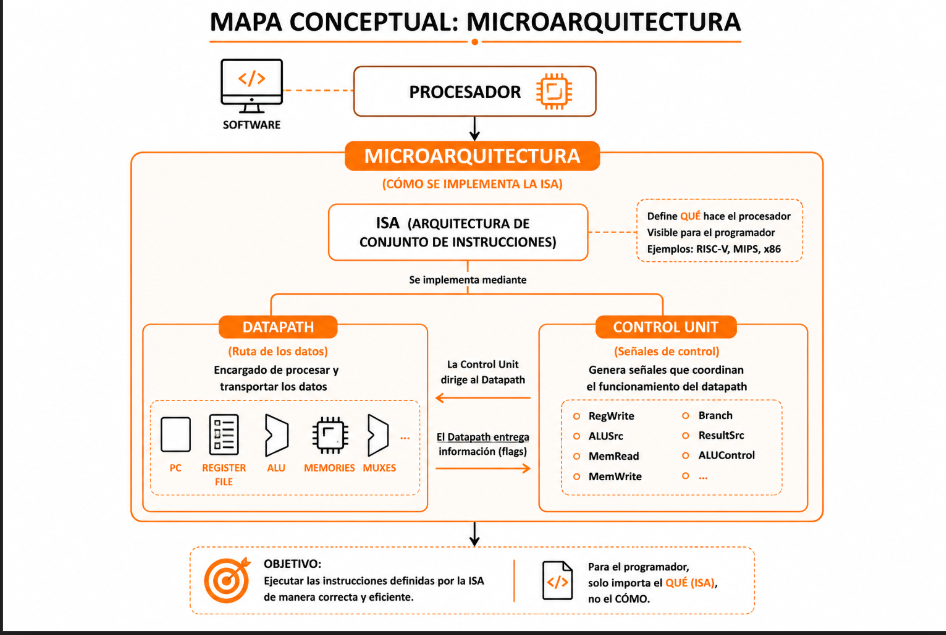
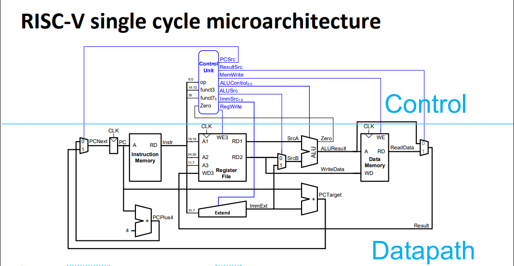

## Arquitectura de Computadoras

La arquitectura de computadores puede representarse mediante la siguiente relación:

**Arquitectura de Computadoras = ISA + Microarquitectura**

## ¿Qué es ISA? 

Define el comportamiento visible para el programador, incluyendo:

- Conjunto de instrucciones.
- Registros.
- Formatos de instrucciones.
- Modos de direccionamiento.
- Modelo de memoria.

En otras palabras, la ISA define **qué hace** el procesador.


## ¿Qué es la Microarquitectura?

La microarquitectura es la forma en que una arquitectura de conjunto de instrucciones (ISA) se implementa físicamente en hardware. Mientras que la ISA define qué instrucciones puede ejecutar un procesador, la microarquitectura describe cómo dichas instrucciones son procesadas internamente.

Desde la perspectiva del programador, solo importa que las instrucciones produzcan los resultados correctos. Sin embargo, internamente el procesador utiliza diversos componentes y mecanismos para lograrlo. Esta implementación es transparente para el software y constituye la microarquitectura del sistema.



Una microarquitectura está compuesta principalmente por dos elementos:

- **Datapath:** conjunto de componentes encargados de procesar y transportar datos, como el contador de programa (PC), la ALU, los registros y las memorias.

- **Unidad de Control:** encargada de generar las señales de control que coordinan el funcionamiento del datapath.




Una misma ISA puede implementarse mediante diferentes microarquitecturas. Entre las más comunes se encuentran las arquitecturas **single-cycle**, **multi-cycle** y **pipeline**. Cada una ejecuta las instrucciones de manera distinta, aunque todas deben respetar el comportamiento definido por la ISA.

## ISA vs Microarquitectura

| Aspecto | ISA (Instruction Set Architecture) | Microarquitectura |
|----------|----------|----------|
| Pregunta que responde | ¿Qué hace el procesador? | ¿Cómo lo implementa? |
| Visible al programador | Sí | No |
| Define | Instrucciones, registros, formatos y memoria | Organización interna del hardware |
| Ejemplos | RISC-V, MIPS, ARM, x86 | Single-Cycle, Multi-Cycle, Pipeline |
| Cambia con frecuencia | Poco | Mucho |
| Compatibilidad | Debe mantenerse para ejecutar programas existentes | Puede cambiar sin afectar al software |
| Componentes principales | Instrucciones, registros, memoria, interrupciones | Datapath, Unidad de Control, cachés, pipeline |
| Objetivo | Especificar el comportamiento del procesador | Implementar la ISA de forma eficiente |

### Relación entre ambos

```text
Arquitectura de Computadoras
│
├── ISA
│   ├── Instrucciones
│   ├── Registros
│   └── Memoria
│
└── Microarquitectura
    ├── Datapath
    └── Unidad de Control


