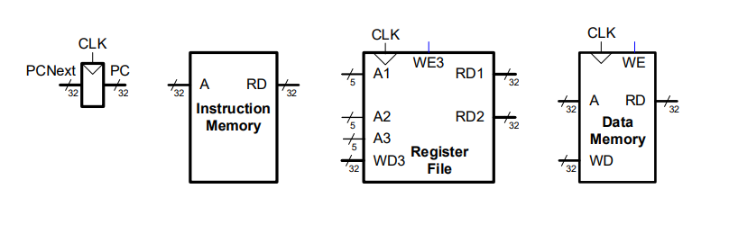
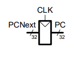

# Mapa a analizar

## Elementos de Estado Arquitectónico
Entre los principales a a analizar son los siguiente elemento:

## Program Counter (PC)

El Program Counter (PC) es un registro especializado que almacena la dirección de memoria de la siguiente instrucción que será ejecutada por el procesador. Su valor se actualiza continuamente durante la ejecución del programa, ya sea avanzando a la siguiente instrucción o apuntando a una dirección de salto.

**Tipo:** Registro especializado.

**Función:** Almacenar la dirección de la siguiente instrucción a ejecutar.

**Entrada:**

* **PCNext (32 bits):** dirección que será cargada en el registro durante el siguiente ciclo de reloj.

**Salida:**

* **PC (32 bits):** dirección actualmente almacenada en el registro.

**Señal de control:**

* **CLK:** señal de reloj utilizada para actualizar el contenido del registro.

**Tamaño:**

* 32 bits.

**Elemento síncrono:**

* Su contenido únicamente puede modificarse durante el flanco activo de la señal de reloj.
* Entre dos flancos consecutivos, el valor almacenado permanece constante.

**Dato almacenado:**

* Dirección de memoria correspondiente a la próxima instrucción.

**Posibles valores de entrada (PCNext):**

* Dirección secuencial (**PC + 4**).
* Dirección objetivo de un salto (*branch*).
* Dirección objetivo de una instrucción de salto (*jump*).

**Relación con otros componentes:**

* Recibe su entrada desde la lógica de selección de la siguiente dirección.
* Su salida es utilizada por la memoria de instrucciones para obtener la instrucción correspondiente.

____________________________________ 

### Instruction Memory

La memoria de instrucciones es el componente encargado de almacenar el programa que será ejecutado por el procesador. A partir de la dirección proporcionada por el Program Counter, suministra la instrucción correspondiente para su procesamiento.

### Register File (RF)

El Register File es un conjunto de 32 registros de propósito general de 32 bits en la arquitectura RISC-V. Estos registros permiten almacenar temporalmente operandos, direcciones y resultados intermedios durante la ejecución de las instrucciones.

### Data Memory

La memoria de datos almacena la información utilizada y generada por los programas durante su ejecución. Este componente es accedido principalmente por instrucciones de carga (*load*) y almacenamiento (*store*).

